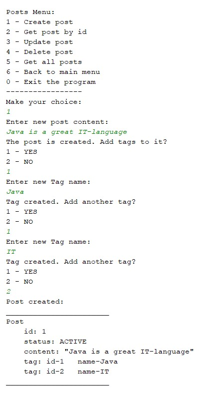
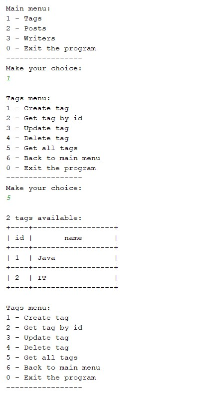
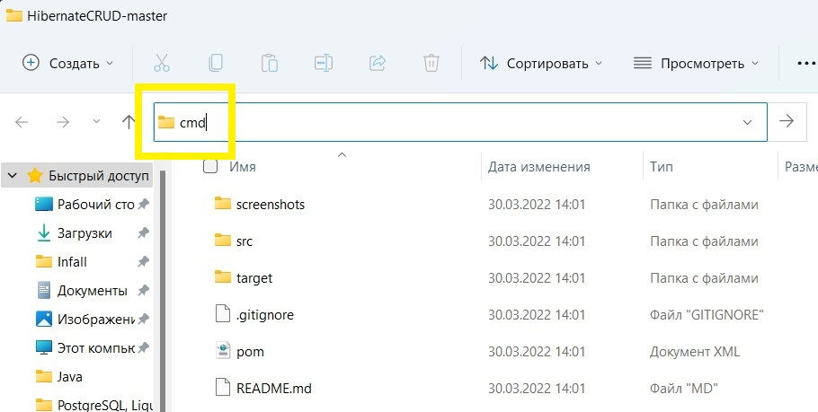
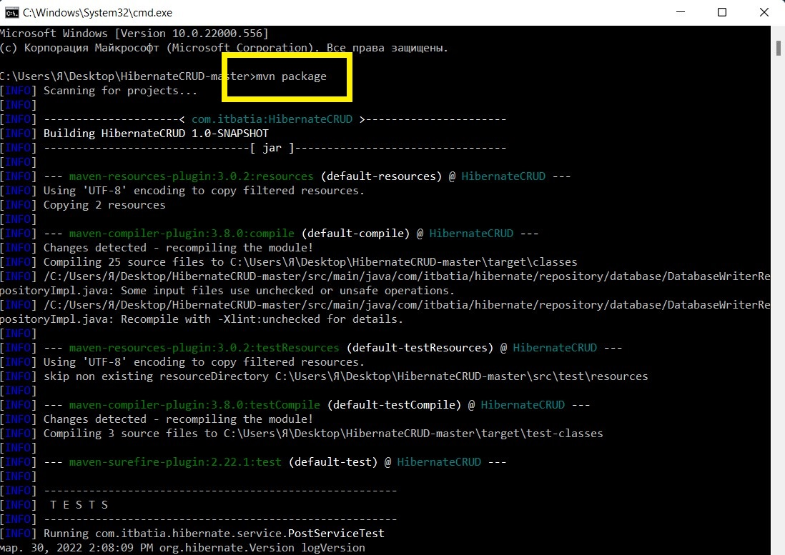
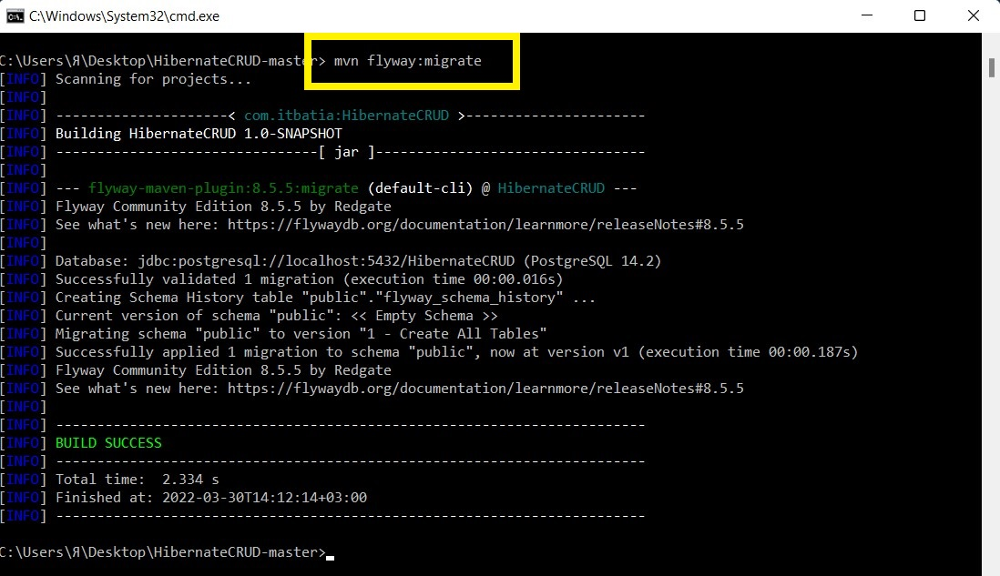
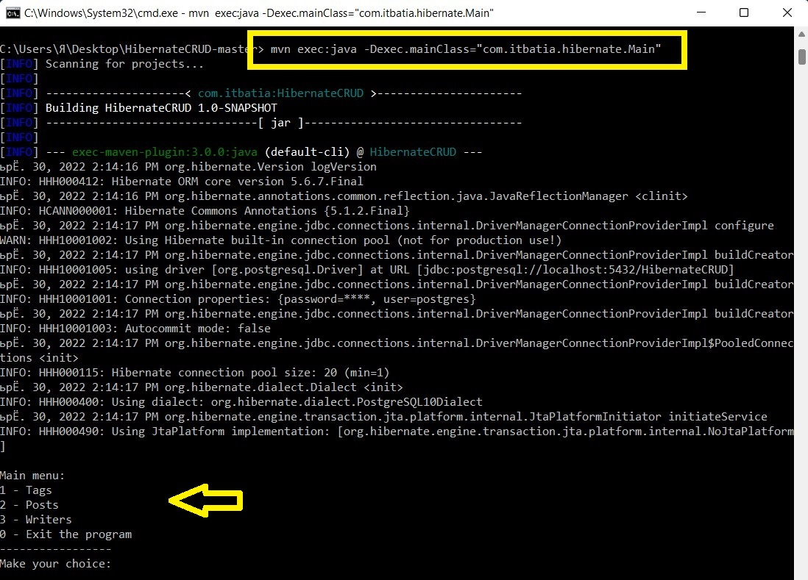

# HibernateCRUD

**HibernateCrud** - это консольное приложение, которое взаимодействует с базой данных. Пользователь имеет возможность выполнять все CRUD операции (create, read, update, delete).   

**Общий стек технологий проекта:** _Java, PostgreSQL, Hibernate, JDBC, Maven, Flyway, JUnit, Mockito, Lombok_.

### Взаимодействие происходит со следующими сущностями:  
>*- Writer (id, name, List<Post<Post>> posts);*  
*- Post (id, content, List<<Tag>Tag> tags, PostStatus status);*   
*- Tag (id, name);*  
*- PostStatus (enum ACTIVE, DELETED).*

### Приложение соответствует требованиям: 
:white_check_mark: Все CRUD операции для каждой сущности   
:white_check_mark: Шаблон __MVC__ (слои: model, repository, service, controller, view)    
:white_check_mark: Для импорта библиотек и сборки проекта - __Maven__   
:white_check_mark: Для взаимодействия с БД используется - __Hibernate__   
:white_check_mark: Для конфигурирования Hibernate - аннотации   
:white_check_mark: Инициализация БД реализована с помощью - __Flyway__   
:white_check_mark: Сервисный слой покрыт Unit-тестами (__JUnit + Mockito__)

|***Пример из консоли:***||
|:----:|:----:|
|||

### Инструкции для запуска приложения:

| № | Этапы выполнения |
|:----:|:----|
| 1 | [Скопируйте код на свой ПК](https://github.com/itbatia/HibernateCRUD/archive/refs/heads/master.zip)|
| 2 | Извлеките содержимое архива. В указанном месте появится папка HibernateCRUD-master. |
| 3 | Для локального использования приложения необходимо внести логин, пароль и URL от своей БД PostgreSQL.     Для этого измените файл pom.xml указав в теге <<properties>properties> свои <database.url>, <username<username>> и <password<password>>.     Соответствующие изменения внесите в файл src\main\resources\hibernate.cfg.xml в property: url, username и password.|
| 4 | Зайдите в папку HibernateCRUD-master и в адресной строке пропишите: cmd |
|   | |
| 5 | Откроется командная строка, в которой необходимо прописать команду: mvn package. Результатом её выполнения будет примерно следующее:|
|   | |
| 6 | Запустите миграцию БД: mvn flyway:migrate |
|   | ||
| 7 | Затем пропишите команду: mvn exec:java -Dexec.mainClass="com.itbatia.hibernate.Main" |
|   | |
| :triangular_flag_on_post: | Программа запущена и готова к использованию! |

*Для последующих запусков выполняйте только пункты № 4 и 7.*